## task4
This is task4. Were supposed to perform most of the best git practices on an actual codebase.

## SCREENSHOTS
## 1. "git add ." This git command adds all the changed lines of code in the codebase into the shipping stage.
##    The "." at the end tells git to add all the changes from the current directory.
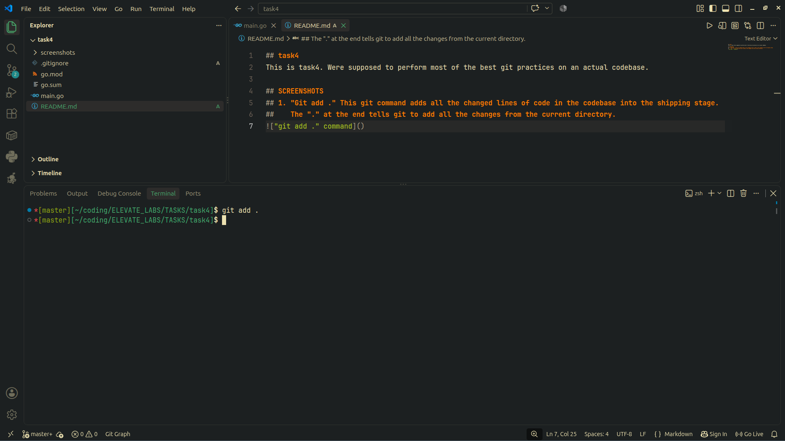

## 2. "git commit -m "Initial commit" " This command commits the added code. and now is ready to push to github.
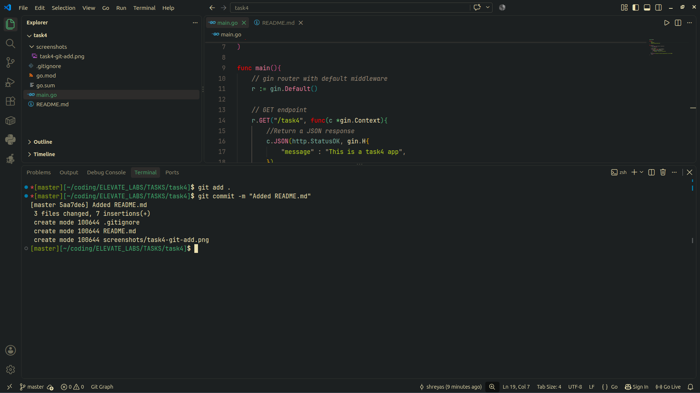

## 3. "github repo created" github repository was created.
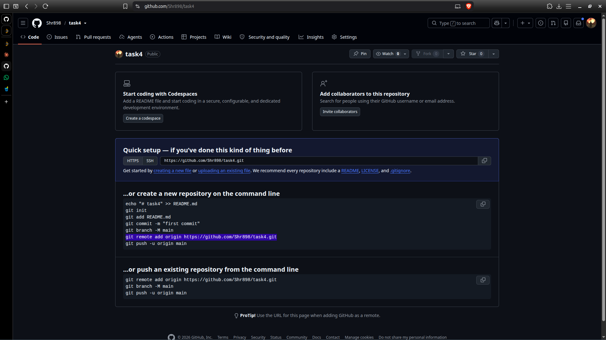

## 4. "git checkout -b dev & git checkout -b feature/new-rest-feature" These commands create 2 branches.
## We first push to feature/new-rest-feature branch then it will be merged to dev branch then finally main branch.
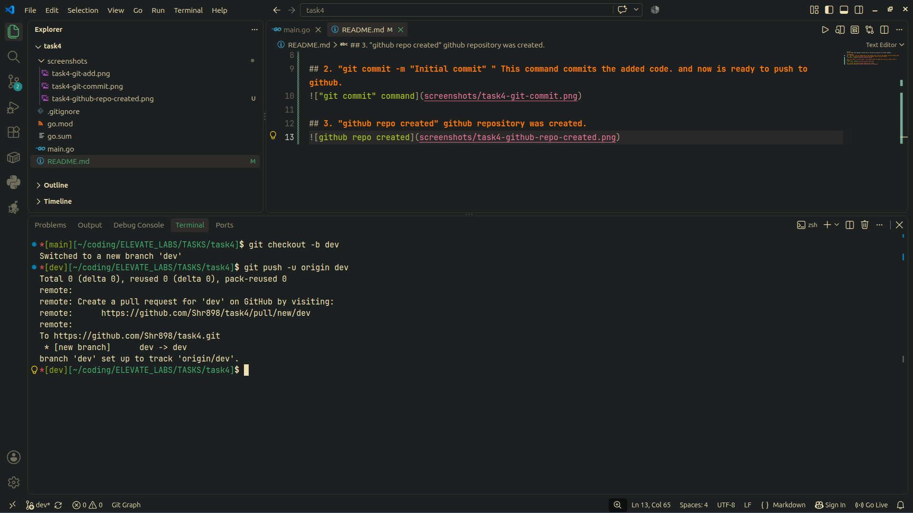
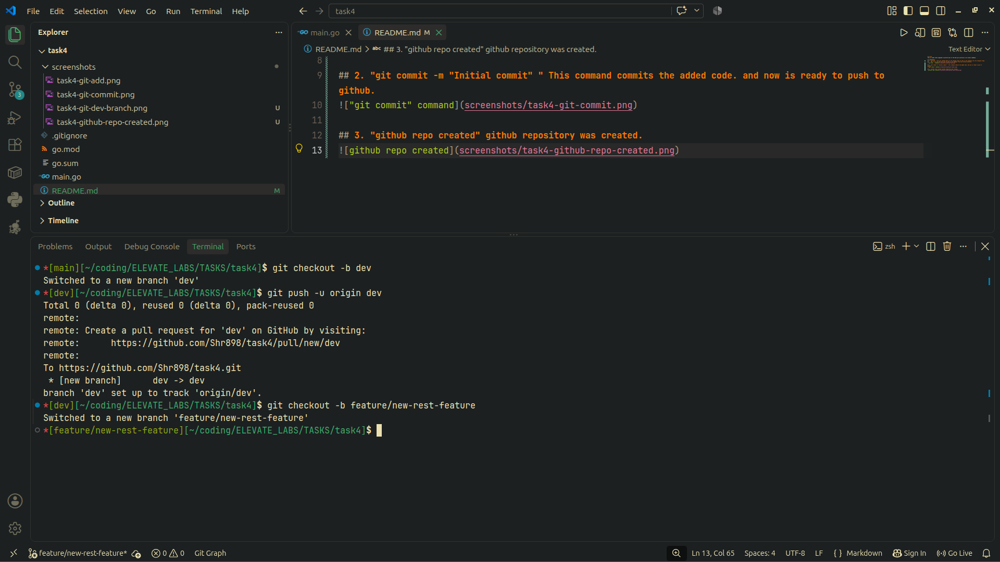

## 5. merging the changes.
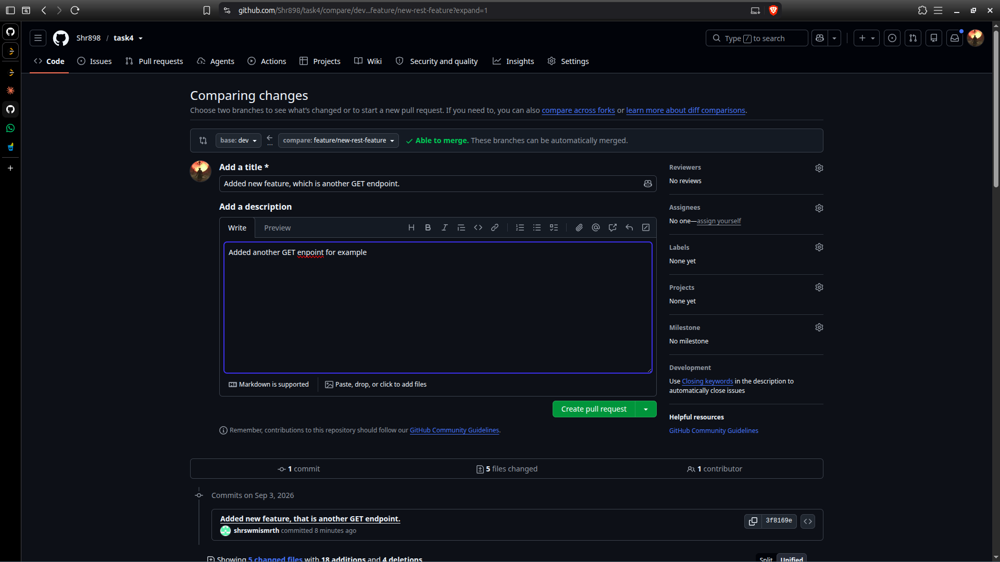
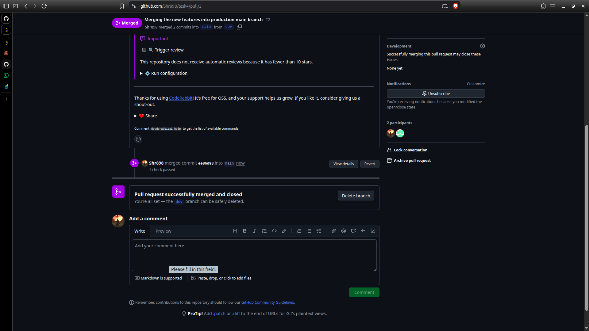
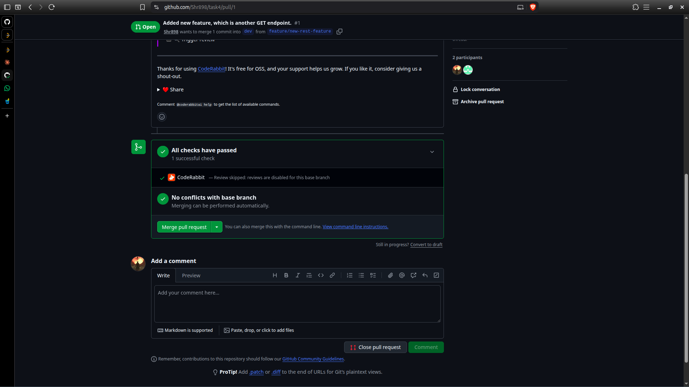
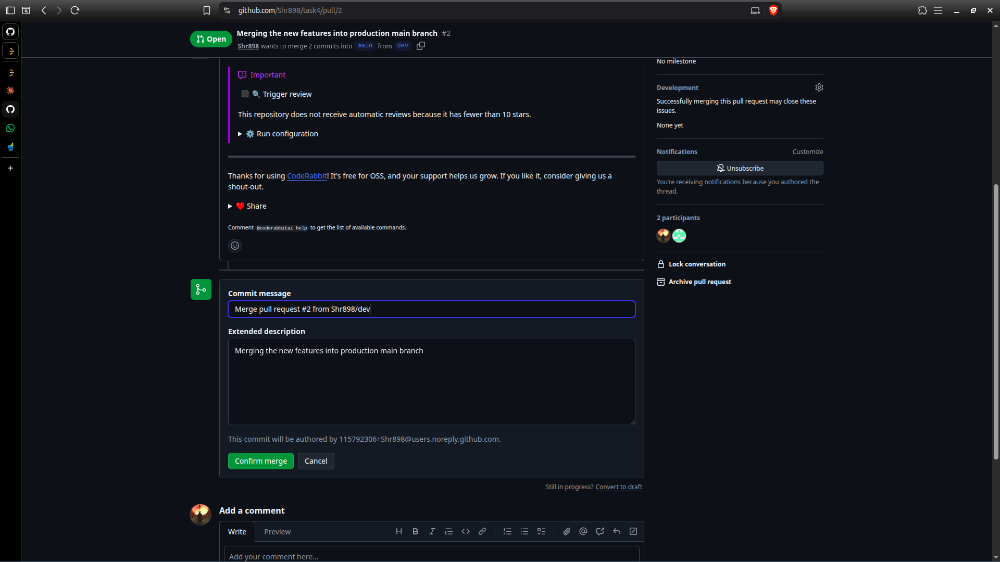
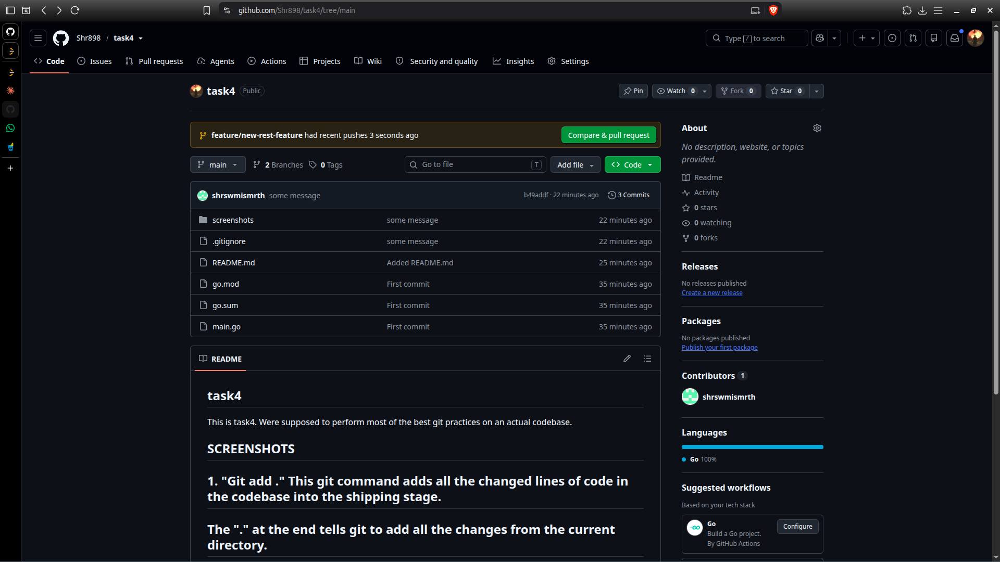

## 6. "git tag". this command will tag a milestone in commits.
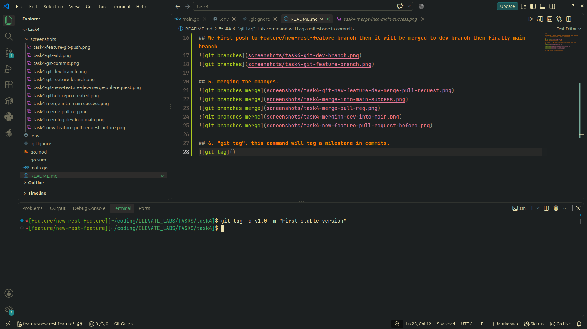

